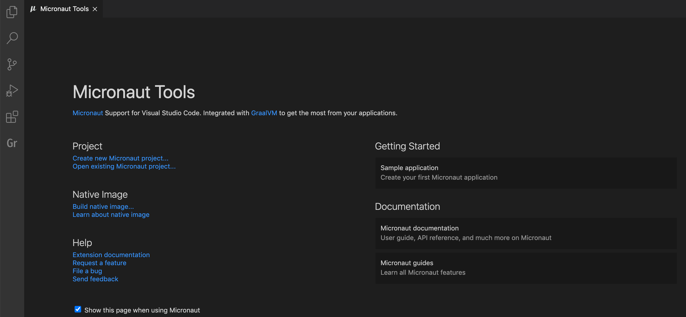
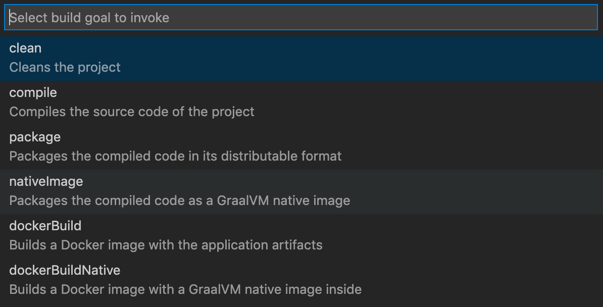

# Micronaut Visual Studio Code Extension <!-- omit in toc -->

The Micronaut extension for Visual Studio Code (VS Code) provides the basic support for developing applications based on the [Micronaut Framework](https://micronaut.io/).
The extension is Technology Preview.

The extension also enables the [Micronaut Launch](https://micronaut.io/launch/) application that allows you to create Micronaut projects through an interface inside VS Code, in addition to using the console CLI.
Optionally, if a user provides a path to the Micronaut CLI installation, the option to create a project using the `mn` executable is also provided.

In combination with the [GraalVM Extension](https://marketplace.visualstudio.com/items?itemName=oracle-labs-graalvm.graalvm), you can run Micronaut projects on GraalVM, and debug them directly from the VS Code development environment with different debugging protocols enabled with the extension.

The Micronaut extension was also developed to help developers build native images right from the VS Code console.

#### Table of contents  <!-- omit in toc -->
- [Installation and Setup](#installation-and-setup)
- [Features](#features)
  - [Micronaut VS Code Commands](#micronaut-vs-code-commands)
  - [Extension Settings](#extension-settings)
- [Create Micronaut Project](#create-micronaut-project)
- [Generate Native Images of Micronaut Projects](#generate-native-images-of-micronaut-projects)
- [Privacy Policy](#privacy-policy)
- [Known Issues](#known-issues)

## Installation and Setup

Install the Micronaut extension from the VS Code consolde by clicking on the "Extensions" icon in the Activity Bar (or invoke it with _Ctrl+Shift+X_). Search for "Micronaut" and install the package. Reload will be required.

Note: The Micronaut extension also requires the [GraalVM Extension](https://marketplace.visualstudio.com/items?itemName=oracle-labs-graalvm.graalvm), which provides support for editing and debugging polyglot programs running on GraalVM. Please install it the same way.

When installed, the Micronaut extension might check whether there is a registered GraalVM instance, and eventually request to download it or point to a local installation (see [GraalVM  Installation and Setup in VS Code](../graalvm/README.md#installation-and-setup)).

Upon installaiton, the Micronaut Tools Page window opens, which provides you with shortcuts to:
- create a new Micronaut project or open an exisiting one
- build a native executable of a Micronaut project
- acquaint you with available features
- redirect you to the documentation available



## Features

The Micronaut extension provides:
* the Micronaut project creation wizard
* installation of Micronaut CLI
* editing and debugging capabilities for Micronaut projects
* the ability to build Micronaut projects ahead-of-time into native images with GraalVM

### Micronaut VS Code Commands

To begin, invoke the Micronaut commands from the View > Command Palette (Command Palette can be also opened by pressing F1, or the _Ctrl+Shift+P_ hot keys combination for Linux, and _Command+Shift+P_ for macOS):


The following commands are available for Micronaut project development:

* `Micronaut: Show Micronaut Tools Page` - show the Micronaut Tools Page
* `Micronaut: Create Micronaut Project` - create a Micronaut project based on https://micronaut.io/launch
* `Micronaut: Build ...` - build a Micronaut project with the user-selected goal/target
* `Micronaut: Build Native Image` - build a native executable of a Micronaut project

### Extension Settings

This extension contributes the following settings:
* __micronaut.home__ - the optional path to the Micronaut CLI installation
* __micronaut.showWelcomePage__ - show the Micronaut Tools Page on extension activation

## Create Micronaut Project

The Create Micronaut Project command in VS Code supports generating Micronaut applications, CLI applications, and other types of applications that a regular Micronaut Launch application does. The wizard prompts users to:

  * pick the application type
  * pick the Micronaut version
  * pick the Java version
  * provide a project name
  * provide a base package name
  * pick the project language (Java, Kotlin, Groovy)
  * pick the project features:

  

  * pick the build tool (Maven or Gradle)
  * pick the test framework (JUnit, Spock, Kotlintest)

Finally, you are asked to select the destination folder on your local disk and whether to open the created project in a new editor or add it to the current workspace.

The GUI part of the Micronaut extension adds a new view to the Explorer activity, which shows Micronaut projects in the current workspace.

## Generate Native Images of Micronaut Projects

The Micronaut support for VS Code is integrated with GraalVM to get the most from the applications and provide you with rich Native Image capabilities.

Having set up GraalVM as the default runtime and debug environment in VS Code, invoke the "Command Palette -> Micronaut: Build..." command, where you can select the build targets (e.g., `clean`, `build`, `nativeImage`, etc.) from a list of available ones.
For example, if your project is built with Maven, and you would like to package the compiled code as a GraalVM native image, select `nativeImage`.
That will run the `mvnw package -Dpackaging=native-image` job.



Besides that, you can push a newly-built native executable to the Docker Registry from the VS Code console.

For more details, continue reading to the [Micronaut documentation](https://guides.micronaut.io/micronaut-creating-first-graal-app/guide/index.html#creatingGraalImage).

## Privacy Policy

Read the [Oracle Privacy Policy](https://www.oracle.com/legal/privacy/privacy-policy.html) to learn more.

## Known Issues

The Micronaut extension 0.5.0 is Technology Preview, meaning the functionality may not be complete.

Please be informed that the subsequent runs of a Micronaut project may fail in this version.
For example, you create a Gradle Micronaut project using GraalVM, run it with the Run / Run Without Debugging command (Ctrl+F5), and then terminate it. If you re-run the project again using the same Run / Run Without Debugging command (Ctrl+F5), startup may fail with this exception:
```shell
[main] ERROR i.m.h.server.netty.NettyHttpServer - Unable to start server. Port already 8080 in use.
```
